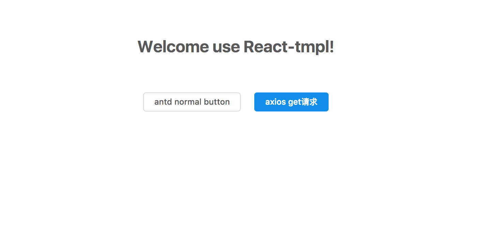

# react-tmpl

React Template project with reactjs,antd and next.js

基于react项目开发复杂？想服务端渲染，配置路由麻烦？等等，不要焦虑，这里有一个方案，一个可以快速开发出中后台产品方案,截图如下：

<p align="center">
  
</p>

## Modules:

#### 1. Router: next.js(react-router)
#### 2. UI: ant-design (as same if you want use Material-UI)
#### 3. Server-render: next.js

## Config Steps:

#### 1.Init project
```
npm init 
```
#### 2. Install modules
```
npm install next antd --save
```
#### 3. Add pages
```
mkdir pages
touch index.js:

import React from 'react'

export default () => (
  <div>Welcome to next.js!</div>
)
```
#### 4. Add cli
```
vi package.json
add:

"scripts": {
    "dev": "next",
    "build": "next build",
    "start": "next start"
}
```
#### 5.Start development
```
npm run dev
```
#### 6.Build product
```
npm run build
```
#### 7.Review product after build it
```
npm run start
```


